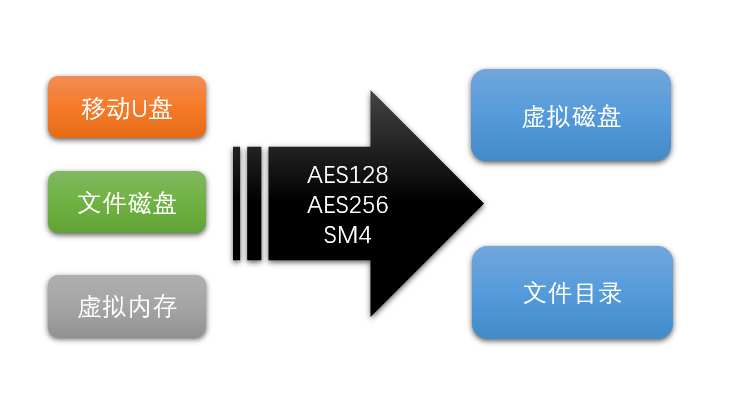
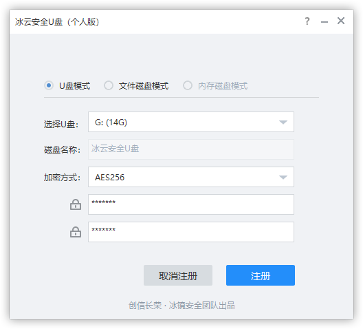
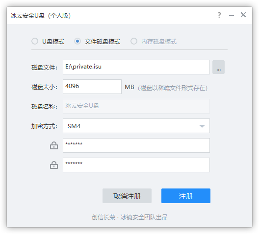
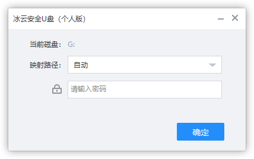
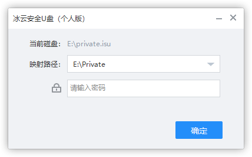

## 简介

冰云安全U盘，保护您的数据安全




iSUDisk（冰云安全U盘）是一款可以将移动U盘、文件磁盘、虚拟内存注册成可以映射到虚拟磁盘、文件目录的多功能磁盘加密工具。支持快速加密模式、AES128、AES256、国密SM4等多种加密方式。

#### 如果你有以下的一些问题，都可以使用冰云安全U盘来解决：

敏感的数据通过U盘拷贝，万一U盘丢失了导致数据泄露怎么办？

公共电脑，想保存一些个人的资料怎么办？

私藏的一些小电影、软件、敏感信息怎么保存才不被人知道？

想针对某一个目录做密码保护怎么办？


## 软件快照









## 使用说明

### U盘模式

注册的时候选择U盘，注册成功后U盘会变成一个只有8M空间的加载盘，里面会包括一个iSUDisk.exe的加载器，启动加载器，验证密码后，即可映射使用加密的磁盘。使用完毕，可以通过托盘的退出卸载磁盘。

### 文件磁盘模块

注册的时候选择保存的文件磁盘位置，保存的后缀名为.isu，保存成功后，isu文件会自动关联打开方式，双击即可启动验证。

### 内存磁盘模式

内存磁盘注册的时候会直接映射成磁盘，全部磁盘读写都在内存中进行，不会有数据落地。

## 版本差异

个人版本公开下载，其他版本联系购买时提供。

### 个人版本

免费使用，部分功能受限。

### 专业版本

真正持续收集专业版本的功能，全部功能均可以使用。

### 企业版本

支持SDK二次开发，可以嵌入企业专属数据，可以配合iDeviceMonitor做U盘信任管理等。

## 二次开发SDK接口

iSUDisk同时封装了非常方便的SDK接口，有需要定制开发需求的企业欢迎咨询

```C++
enum {
	emSUDiskMaxString = 64,
	emSUDiskMaxBuffer = 1024,
};

enum emSUDiskEncryptType
{
	emSUDiskEncryptNone,
	emSUDiskEncryptQuick,
	emSUDiskEncryptAES128,
	emSUDiskEncryptAES256,
	emSUDiskEncryptSM4,
};

struct SUDiskRegistration 
{
	emSUDiskEncryptType EncryptType;
	ULONG Reserved;
	ULONGLONG DiskSize;
	LPCWSTR Password;
	LPCWSTR DiskLabel;			// MAX_LENGTH = emSUDiskMaxString
	LPCWSTR DiskRegisterName;	// MAX_LENGTH = emSUDiskMaxString
	UCHAR DiskCustomData[emSUDiskMaxBuffer];
};

struct SUDiskInfo 
{
	emSUDiskEncryptType EncryptType;
	ULONG IsNeedPassword : 1;
	ULONG Reserved : 31;
	WCHAR DiskLabel[emSUDiskMaxString];
	WCHAR DiskRegisterName[emSUDiskMaxString];
	UCHAR DiskCustomData[emSUDiskMaxBuffer];
};

interface __declspec (uuid(SUDISK_IID_MOUNT_CONTEXT)) ISUDiskMountContext : public IUnknown
{
	virtual LPCWSTR	GetMountPath		(void) = 0;
	virtual HRESULT	SetAutoUnmount		(bool Enable) = 0;
	virtual HRESULT	ExploreMountPath	(void) = 0;
};

interface __declspec (uuid(SUDISK_IID_SUDISK)) ISUDisk : public IUnknown
{
	virtual HRESULT Register			(LPCWSTR DiskPath, const SUDiskRegistration& Registration) = 0;
	virtual HRESULT Unregister			(LPCWSTR DiskPath) = 0;
	virtual HRESULT	Mount				(LPCWSTR DiskPath, LPCWSTR MountPath, LPCWSTR Password, ISUDiskMountContext** Context) = 0;
	virtual HRESULT MountRamDisk		(ULONGLONG DiskSize, LPCWSTR MountPath, ISUDiskMountContext** Context) = 0;
	virtual HRESULT Unmount				(LPCWSTR MountPath) = 0;
	virtual HRESULT GetDiskInfo			(LPCWSTR DiskPath, SUDiskInfo* Info) = 0;
	virtual HRESULT GetVerifiedDiskInfo	(LPCWSTR DiskPath, LPCWSTR Password, SUDiskInfo* Info) = 0;
	virtual HRESULT	ResetPassword		(LPCWSTR DiskPath, LPCWSTR Password, LPCWSTR NewPassword) = 0;
};
```
